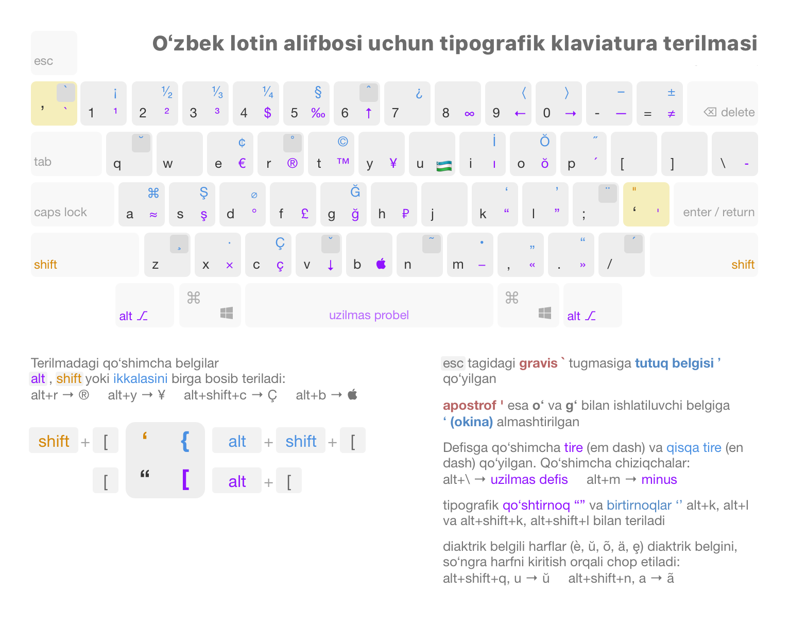

# Uzbek (Latin) Keyboard Layout

This repository contains an enhanced Uzbek Latin keyboard layout for Linux, designed to improve the typing experience by providing quick access to special characters used in the language.



### Features

- **Standard Uzbek Latin characters:** Includes oʻ and gʻ.

- **Enhanced symbols:** Adds endash, emdash, and other common symbols.

- **Improved layout:** Optimizes key placement for a more intuitive typing experience.

### Installation

The provided `install.sh` script automates the installation process by copying the layout file and updating the system's XKB configuration.

#### Prerequisites

You must be using a Linux distribution that uses the XKB system, such as Ubuntu, Debian, or Fedora.

#### Steps

1. Clone the repository:

```bash
git clone https://github.com/itsbilolbek/uzbek-latin-keyboard.git
cd uzbek-latin-keyboard
```

2. Run the installation script:

```bash
chmod +x install.sh
sudo ./install.sh
```

The script will copy the layout file to the correct system directory, add an entry to the evdev.xml file, and reconfigure your keyboard settings.

### Usage

After a successful installation, you may need to **log out and log back in** for the new layout to appear in your system settings.

To select the layout:

1. Go to your system's **Settings > Keyboard** (or **Input Sources**).

2. Add a new keyboard layout.

3. Search for **"Uzbek (Latin)"** and add it to your list of input sources.

### Contributing

If you find an issue or have suggestions for improvements, feel free to open a pull request or an issue on this repository.